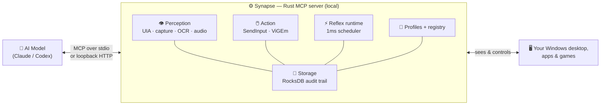
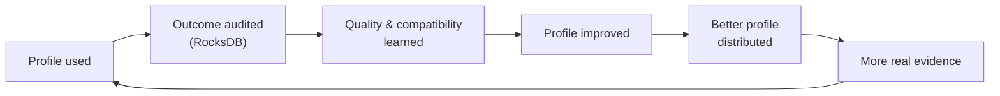

<p align="center">
  
</p>

<h1 align="center">Synapse</h1>

<p align="center">
  <strong>Give your AI agent a real body on your Windows PC.</strong><br>
  Structured perception, precise action, and sub-millisecond reflexes — as a local MCP server.
</p>

<p align="center">
  
  
  
  
  
</p>

<p align="center">
  <a href="https://www.youtube.com/@Leapableai"></a>
  <a href="https://x.com/ChrisRoyseAI1"></a>
  <a href="https://www.linkedin.com/in/christopher-royse-b624b596/"></a>
</p>

---

## The idea in one line

> **Your AI model is the brain. Synapse is the body.**

Large language models can reason brilliantly — but on their own they can't *see*
your screen, *move* your mouse, *press* a key, or *react* in time. Synapse is the
missing body. It's a fast, local **Rust** server that speaks the
[Model Context Protocol](https://modelcontextprotocol.io) and plugs straight into
**Claude Code, Codex, and the Claude Desktop app**, giving the connected model a
real, low-latency interface to your Windows machine.

<p align="center">
  
</p>

Everything runs **on your machine**. No screen-scraping cloud service, no remote
agent, no data leaving your PC. Synapse is Windows-native to the metal: Win32
`SendInput`, UI Automation, Windows Graphics Capture / DXGI, WASAPI audio, and
ViGEmBus virtual controllers.

---

## What you can do with it

Synapse exposes **80 live MCP tools**. Here's what that unlocks.

### 👁️ It can see — structured perception


Synapse hands the model the screen as **clean, low-token structured data**, not a
giant screenshot it has to squint at:

- **`observe`** — the focused window, the full UI Automation element tree (every
  button, field, and menu with its on-screen box), detected entities, and HUD.
- **`find`** — locate any element or on-screen entity by name, role, or free text.
- **Browser DOM mode** — Synapse-launched Chromium browsers can expose page
  nodes through CDP; see [Browser and Web Perception](docs/browser-perception.md).
- **`read_text`** — OCR any region or element. Reads pixels directly, so it works
  even where the accessibility API can't reach (games, canvases, custom UIs).
- **`audio_tail` / `audio_transcribe`** — capture and transcribe system audio
  (Whisper) so the agent can *hear* what's happening.
- **`set_perception_mode`** — switch between accessibility, raw-pixel, or hybrid
  sensing on demand.

<br clear="all">

### 🖱️ It can act — precise, human-like control


Real input, synthesized through Win32 — not brittle macros:

- **`act_click`, `act_aim`, `act_drag`, `act_scroll`** — mouse control with
  natural, instant, linear, or eased motion curves.
- **`act_type`, `act_press`, `act_keymap`** — type Unicode text with *human-like*
  keystroke dynamics, press chords, or fire profile-defined key aliases.
- **`act_pad`** — a full **virtual Xbox / DualShock controller** via ViGEmBus.
- **`act_clipboard`, `act_combo`, `act_launch`, `act_run_shell`** — clipboard
  round-trips, timed input sequences, and launching apps.
- **`release_all`** — one call instantly releases every held key, button, and
  axis. There's also an operator panic hotkey for a hard stop.

<br clear="all">

### ⚡ It can react — sub-millisecond reflexes


A network round-trip to an LLM takes hundreds of milliseconds. Some things can't
wait that long. Synapse runs an **in-process reflex scheduler on a 1ms tick** so
it can react *the instant* an event fires — no round-trip to the model:

- **`reflex_register`** — arm an `AimTrack`, `HoldMove`, `HoldButton`, `Combo`,
  or `OnEvent` reflex that fires automatically on the conditions you set.
- **`reflex_list`, `reflex_history`, `reflex_cancel`** — inspect, audit, and
  disarm. Every fire is timestamped to a scheduler tick (typical p99 jitter is
  **single-digit microseconds**) and written to durable storage.

<br clear="all">

### 🔭 It tracks change — delta-first reality


Re-sending the whole screen on every step is slow and expensive. Synapse takes a
**baseline**, then streams the agent **only what changed** — and audits its own
assumptions against physical reality:

- **`reality_baseline`** — a compact, redacted snapshot (~hundreds of tokens).
- **`observe_delta`** — ordered, field-level changes since a cursor. Change a
  clipboard, a window, a value — you get back *just that delta*.
- **`reality_audit`** — re-reads the real machine and reports drift, forcing a
  rebase when the agent's mental model has gone stale.

<br clear="all">

### 🧠 It learns — the profile + audit flywheel


Synapse ships **29 app/game profiles** that encode how to operate Notepad, Chrome,
Excel, Paint, Explorer, Terminal, and more — and it gets *better with use*:

- Every action is logged to a local **RocksDB** audit trail.
- **`profile_quality_refresh`** turns those real outcomes into a quality score
  (Wilson-bounded success rate) per profile.
- **`audit_intelligence_query`** summarizes what worked, by app and by tool.
- The **`profile_registry_*`** and **`profile_authoring_*`** families let you
  author, sign, install, roll back, and share profile packages — with consent and
  provenance built in.

This is the compounding loop: *profile used → outcome audited → quality learned →
profile improved → better profile distributed → more evidence.*

<br clear="all">

### 🎮 It plays games


Pixel-perception, virtual controllers, and reflexes make Synapse a serious game
agent. It ships a full **EverQuest** domain pack — 20+ tools spanning live state
estimation, map sensing, hazard/safe-area memory, route planning, a planner
guard, trajectory/episode export, a ContextGraph memory bridge, a transparent
predictive model, and surprise detection — a complete
**perceive → remember → plan → act → learn** loop, plus benchmark profiles for
Minecraft and Luanti/Minetest.

<br clear="all">

### 🔒 It stays yours — 100% local & private


- Runs entirely on your machine over **stdio** or **loopback HTTP** (bearer-auth,
  loopback-only by default).
- Sensitive fields are **hash-redacted** before they're ever persisted — raw
  clipboard text, window titles, chat bodies, and secrets never hit storage.
- Audit export is **off unless you consent**, with a redaction report.
- The profile registry works **offline and account-free**.

<br clear="all">

---

## How it works



The model stays the planner. Synapse owns the fast, native, stateful parts —
perception assembly, input emission, reflexes, and a durable audit trail — so the
agent gets crisp senses, reliable hands, and a memory of what worked.

### The learning flywheel



---

## Install

Open Claude Code, Codex, or any coding agent **on the Windows machine you want
Synapse to control**, and paste this:

```text
Install Synapse for me and wire it into my AI tools.

1. Clone the repo: git clone https://github.com/ChrisRoyse/Synapse.git
   (cd into it; if it already exists, git pull instead).
2. Build and install the MCP server globally with cargo:
     cargo install --path crates/synapse-mcp --force
   This drops synapse-mcp.exe into my Cargo bin dir
   (%USERPROFILE%\.cargo\bin\synapse-mcp.exe). Find the absolute path to that
   binary and use it verbatim in every config below.
3. Connect it to Claude Code (user scope):
     claude mcp add --scope user synapse -- "<absolute path>\synapse-mcp.exe" --mode stdio
4. Connect it to Codex by adding this to ~/.codex/config.toml:
     [mcp_servers.synapse]
     command = "<absolute path>\\synapse-mcp.exe"
     args = ["--mode", "stdio"]
5. Connect it to the Claude Desktop app by adding a "synapse" server to
   %APPDATA%\Claude\claude_desktop_config.json under "mcpServers" with the same
   command and ["--mode","stdio"] args. Preserve any existing servers in that file.
6. Verify: restart each client, then call the Synapse `health` tool and confirm
   it returns { "ok": true, ... }.

I'm on Windows. Use the real absolute Cargo bin path, don't invent one, and tell
me anything that needs my approval (e.g. installing the Rust toolchain).
```

You'll need a stable **Rust toolchain** (`rustup` / `cargo`). If `cargo` is
missing, grab it from <https://rustup.rs> first, or let the agent install it.

### Setup scripts (Windows **or** WSL — Windows always controls both)

Synapse has exactly **one controlling body**: the Windows-native
`synapse-mcp.exe` HTTP daemon. It is the only process that can perform real Win32
`SendInput`, UI Automation, and WGC/DXGI capture — and it controls **both**
Windows programs (native windows) **and** WSL programs (WSLg GUI apps render as
real Windows windows; `act_run_shell` / `act_launch` reach WSL CLIs via
`wsl.exe`). Every MCP client — on Windows or in WSL — connects to that one
daemon, so *wherever you install from, the result is identical*: one Windows
daemon driving both worlds.

**From WSL** (builds the Windows daemon through interop, then wires Claude Code
and Codex on the WSL side):

```bash
./scripts/synapse-install.sh
```

**From native Windows** (PowerShell):

```powershell
./scripts/synapse-setup.ps1 -SourceDir (Resolve-Path .)
```

Both are idempotent and fail loud — each prerequisite is checked and a failure
stops with the exact cause and fix (no silent fallbacks). They build the daemon
from a **local** source path into a persistent target (re-installs are
incremental, not a fresh RocksDB build), deploy the bundled profiles next to the
binary, generate a loopback bearer token, register the auto-start daemon
(interactive desktop session, single-writer DB) with `--profile-dir`, verify
`health`, and wire the detected MCP clients (Claude Code via HTTP on Windows /
the connect bridge in WSL; Codex and Claude Desktop via the connect bridge).
Re-run any time to update; `-Remove` (PowerShell) uninstalls the daemon task.

### Build it yourself

```bash
cargo build --release --workspace
cargo install --path crates/synapse-mcp --force   # -> %USERPROFILE%\.cargo\bin\synapse-mcp.exe
```

### Wire it up manually

<details>
<summary><strong>Claude Code, Codex, and Claude Desktop config</strong></summary>

Claude Code (user scope):

```bash
claude mcp add --scope user synapse -- <cargo-bin>\synapse-mcp.exe --mode stdio
```

Codex (`~/.codex/config.toml`):

```toml
[mcp_servers.synapse]
command = "C:\\Users\\you\\.cargo\\bin\\synapse-mcp.exe"
args = ["--mode", "stdio"]
```

Claude Desktop (`%APPDATA%\Claude\claude_desktop_config.json`):

```jsonc
{
  "mcpServers": {
    "synapse": {
      "command": "C:\\Users\\you\\.cargo\\bin\\synapse-mcp.exe",
      "args": ["--mode", "stdio"]
    }
  }
}
```

</details>

After the client loads the server, ask it to call the `health` tool — you should
get back `{ "ok": true, "version": "0.1.0", ... }` with each subsystem's status.

---

## See it in action

Once it's connected, just ask your agent in plain English. For example:

> *"Open Notepad, type a short intro to Synapse, then select-all, copy, and read
> the clipboard back to prove the text landed."*

> *"Open Paint and draw a five-point star on the canvas with mouse drags."*

> *"Take a reality baseline, then tell me only what changed after I open a new
> window."*

> *"Register a reflex that reacts the instant a window-focus event fires, show me
> it firing, then disarm it."*

Behind the scenes the agent calls `act_launch`, `act_type`, `act_drag`,
`observe`, `read_text`, `reality_baseline`, `reflex_register`, and friends — and
every action is captured to the local audit trail.

---

## The full tool surface

Call `tools/list` on the running `synapse-mcp` server for the complete registry.
At a glance:

| Group | Tools |
|---|---|
| **Perception** | `observe` · `find` · `read_text` · `audio_tail` · `audio_transcribe` · `subscribe` · `set_capture_target` · `set_perception_mode` |
| **Delta-first reality** | `reality_baseline` · `observe_delta` · `reality_audit` |
| **Action** | `act_click` · `act_type` · `act_press` · `act_keymap` · `act_aim` · `act_drag` · `act_scroll` · `act_pad` · `act_clipboard` · `act_combo` · `act_run_shell` · `act_launch` · `release_all` |
| **Reflexes** | `reflex_register` · `reflex_cancel` · `reflex_list` · `reflex_history` |
| **Profiles, registry & audit** | `profile_list` · `profile_activate` · `profile_quality_refresh` · `profile_authoring_*` · `profile_registry_*` · `audit_intelligence_query` · `audit_export_consent_set` · `audit_export_bundle` |
| **Storage & health** | `health` · `storage_inspect` · `storage_gc_once` · `storage_pressure_sample` · `replay_record` |
| **EverQuest domain pack** | `everquest_*` — state, memory, planner guard, route plan, map sensor, trajectory/episode export, ContextGraph bridge, predictive model, surprise detection, scorecard |

---

## Under the hood

| Layer | Technology |
|---|---|
| Language / runtime | **Rust** (edition 2024), `tokio` |
| Protocol | **MCP** via `rmcp` — stdio + streamable HTTP/SSE |
| Perception | Windows UI Automation, Windows Graphics Capture / DXGI duplication, WinRT OCR |
| Action | Win32 `SendInput` (`enigo`), **ViGEmBus** virtual controllers |
| Audio | WASAPI loopback + Whisper-tiny STT |
| Storage | **RocksDB** (11 column families, LZ4 + ZSTD), durable audit trail |
| Models | ONNX Runtime (`ort`) for optional detection |

Two live input backends: **`software`** (keyboard + mouse via `SendInput`) and
**`vigem`** (virtual Xbox/DualShock via ViGEmBus). Reflexes, storage GC, and
disk-pressure handling all run as background tasks inside the server.

---

## About the author

Synapse is designed and built by **Chris Royse** — solo developer, founder of
**Leapable AI**.

<p align="center">
  <a href="https://www.youtube.com/@Leapableai"></a>
  <a href="https://x.com/ChrisRoyseAI1"></a>
  <a href="https://www.linkedin.com/in/christopher-royse-b624b596/"></a>
</p>

Follow along on **[YouTube @Leapableai](https://www.youtube.com/@Leapableai)** for
demos and deep dives, and on **[X @ChrisRoyseAI1](https://x.com/ChrisRoyseAI1)**
for updates.

---

## License

**Synapse is source-available, not open source.**

- ✅ **Free for noncommercial use** under the
  [PolyForm Noncommercial License 1.0.0](LICENSE.md).
- 💼 **Commercial or business use** — using Synapse inside a company, or building
  a product or service with it — requires a separate **paid commercial license**.
  See [COMMERCIAL-LICENSE.md](COMMERCIAL-LICENSE.md) or email
  **chrisroyseai@gmail.com**.

Copyright © 2026 Chris Royse. See [LICENSE.md](LICENSE.md) for full terms.

---

## 💛 Support Synapse

Synapse is built and maintained by one solo developer. If it's useful to you — or
you'd like to help fund new app/game profiles, features, and ongoing development —
please consider sending a donation or a message of support.

<p align="center">
  <a href="https://www.paypal.com/paypalme/ChrisRoyseAI"></a>
</p>

<p align="center">
  👉 <strong><a href="https://www.paypal.com/paypalme/ChrisRoyseAI">paypal.me/ChrisRoyseAI</a></strong> — donate or send a message to help support Synapse.
</p>

Every contribution directly funds buying apps/games to profile, token costs for
testing, and the time to keep shipping. Thank you! 🙏

---

<p align="center">
  <em>Your AI has a brain. Now give it a body.</em><br>
  <strong>⭐ Star the repo if Synapse is useful to you.</strong>
</p>

<p align="center">
  📫 <strong>Contact me:</strong> <a href="mailto:chrisroyseai@gmail.com">chrisroyseai@gmail.com</a>
</p>
