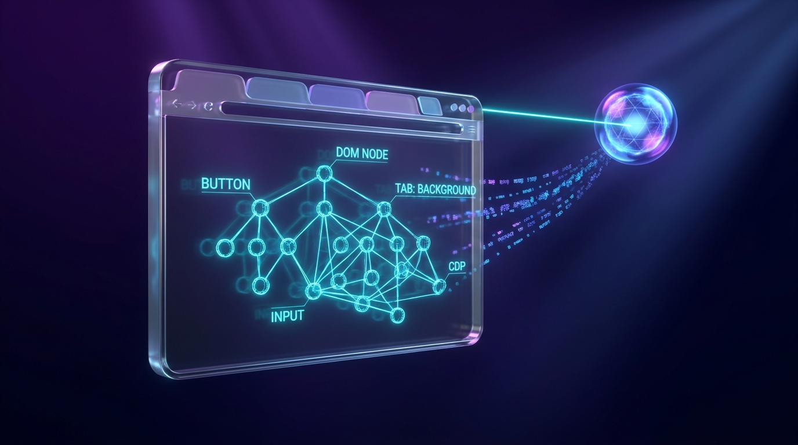
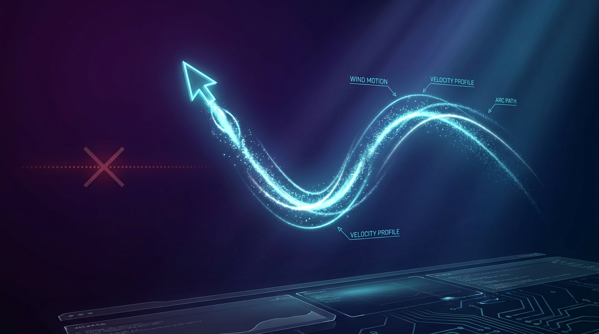
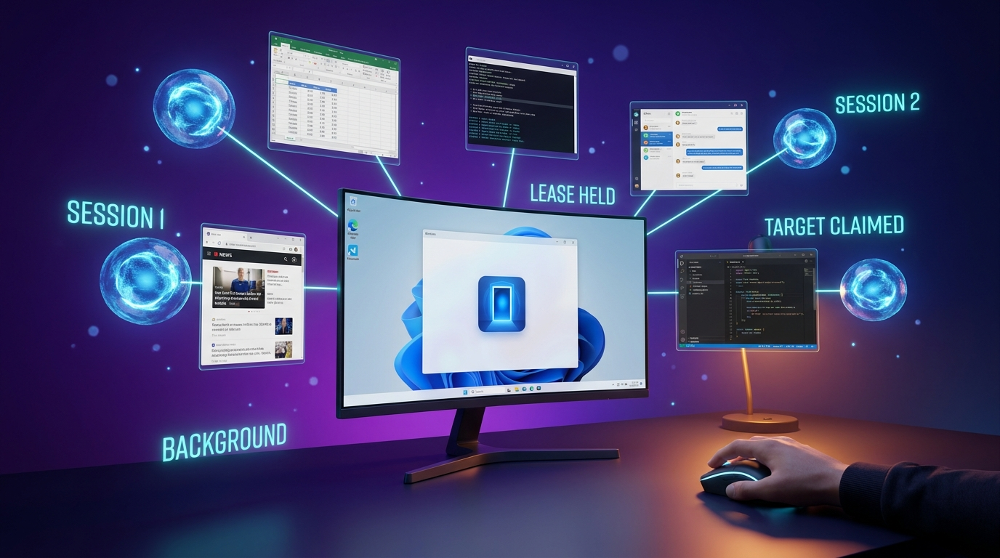
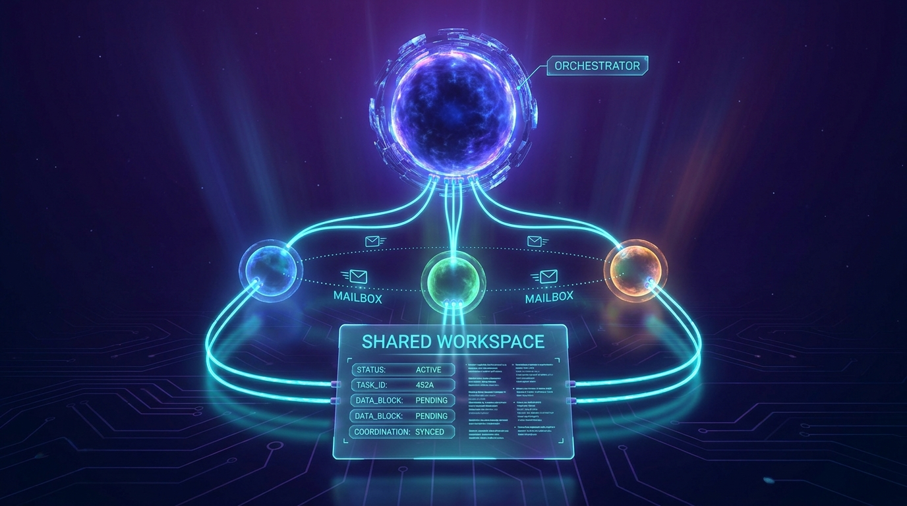
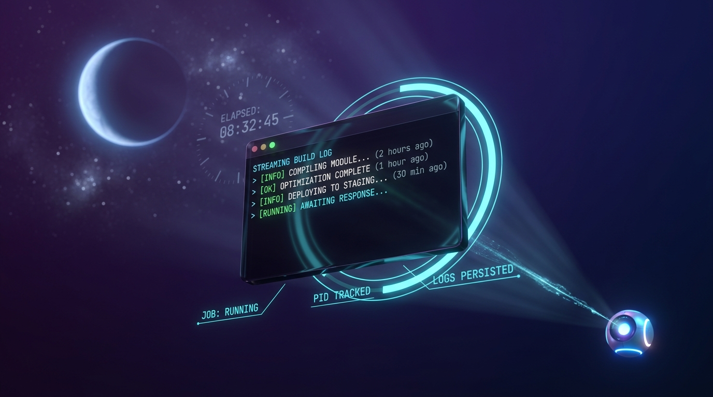
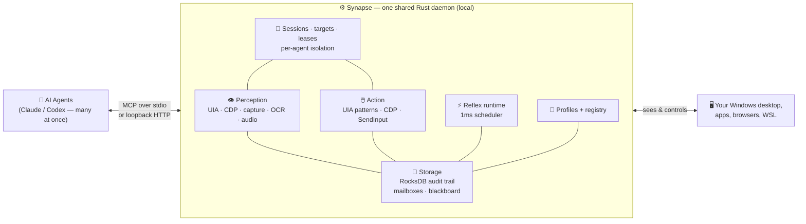
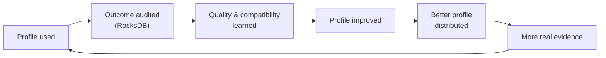

<p align="center">
  
</p>

<h1 align="center">Synapse</h1>

<p align="center">
  <strong>Give your AI agent a real body on your Windows PC.</strong><br>
  Structured perception, precise action, and sub-millisecond reflexes — as a local MCP server.
</p>

<p align="center">
  
  
  
  
  
</p>

<p align="center">
  <a href="https://www.youtube.com/@Leapableai"></a>
  <a href="https://x.com/ChrisRoyseAI1"></a>
  <a href="https://www.linkedin.com/in/christopher-royse-b624b596/"></a>
</p>

---

## The idea in one line

> **Your AI model is the brain. Synapse is the body.**

Large language models can reason brilliantly — but on their own they can't *see*
your screen, *move* your mouse, *press* a key, or *react* in time. Synapse is the
missing body. It's a fast, local **Rust** server that speaks the
[Model Context Protocol](https://modelcontextprotocol.io) and plugs straight into
**Claude Code, Codex, and the Claude Desktop app**, giving the connected model a
real, low-latency interface to your Windows machine. And not just *one* model —
a whole **team of agents** can share the same PC through one Synapse daemon,
each in its own isolated session, while you keep your mouse.

<p align="center">
  
</p>

Everything runs **on your machine**. No screen-scraping cloud service, no remote
agent, no data leaving your PC. Synapse is Windows-native to the metal: Win32
`SendInput`, UI Automation, Windows Graphics Capture / DXGI, WASAPI audio, and
local process control.

---

## What you can do with it

Synapse exposes **81 live MCP tools**. Here's what that unlocks.

### 👁️ It can see — structured perception


Synapse hands the model the screen as **clean, low-token structured data**, not a
giant screenshot it has to squint at:

- **`observe`** — the focused window, the full UI Automation element tree (every
  button, field, and menu with its on-screen box), detected entities, and HUD.
- **`find`** — locate any element or on-screen entity by name, role, or free text.
- **Browser DOM mode** — Synapse-launched Chromium browsers can expose page
  nodes through CDP; see [Browser and Web Perception](docs/browser-perception.md).
- **`read_text`** — OCR any region or element. Reads pixels directly, so it works
  even where the accessibility API can't reach (canvases and custom UIs).
- **`capture_screenshot`** — per-window Windows Graphics Capture, so an agent
  can photograph *its own* window even when it's behind yours.
- **`audio_tail` / `audio_transcribe`** — capture and transcribe system audio
  (Whisper) so the agent can *hear* what's happening.
- **`set_perception_mode`** — switch between accessibility, raw-pixel, or hybrid
  sensing on demand.

All of it is **window-targetable**: point a session at a specific window with
`set_target` and `observe`, `find`, `read_text`, and `capture_screenshot` watch
*that* window — focused or not.

<br clear="all">

### 🖱️ It can act — precise, human-like control


Real input, synthesized through Win32 — not brittle macros:

- **`act_click`, `act_stroke`, `act_scroll`** — mouse control with timing
  profiles for point/element moves, optional-button drags, and explicit shaped
  paths; see [Motion Semantics](docs/motion-semantics.md).
- **`act_type`, `act_press`, `act_keymap`** — type Unicode text with *human-like*
  keystroke dynamics, press chords, or fire profile-defined key aliases.
- **`act_set_value`** — set a field's value directly through UI Automation and
  read it back from the source of truth — no keystrokes needed.
- **`act_clipboard`, `act_combo`, `act_launch`, `act_focus_window`** — clipboard
  round-trips, timed input sequences, launching apps (including *hidden*
  launches that never flash a window), and explicit, lease-gated window focus.
- **`act_run_shell`** — run any allowlisted shell command, with **durable
  background jobs** for the long ones (more below).
- **`release_all`** — one call instantly releases every held key, button, and
  axis. There's also an operator panic hotkey for a hard stop.

Actions don't just *fire* — they **verify**. Every click, keystroke, and value
write is read back from a separate source of truth (UIA state, CDP DOM, even
OCR of the pixels) so the agent knows the action *actually landed*, not just
that the input was sent.

<br clear="all">

### 🌐 It can browse — silent background web control



The web isn't pixels to Synapse — it's **structured DOM data**, and it can work
it *without ever touching your mouse or stealing a tab*:

- **CDP DOM perception** — for Chromium browsers (Chrome, Edge, Brave, …),
  `observe` and `find` merge real page nodes — every button, link, and input
  with its box — straight from the DevTools accessibility tree.
- **`cdp_open_tab`, `cdp_navigate_tab`, `cdp_close_tab`** — open, navigate,
  reload, and close **background tabs** that never become the active tab. The
  page you're reading stays exactly where it is.
- **Background page input** — clicks, scrolls, and typing route through CDP
  (`insertText`, dispatched events) instead of the cursor, so web forms fill
  while the browser sits behind your work.
- **Graceful fallback ladder** — raw CDP → bundled Chrome extension bridge →
  OCR over the rendered page → honest `uia_only`, with diagnostics that tell
  the agent *which* path it got, so "no button found" never silently means
  "page wasn't readable."

See [Browser and Web Perception](docs/browser-perception.md) for the full
strategy ladder.

<br clear="all">

### 🎯 It moves like a human — wind-mouse motion synthesis



Robotic, perfectly-straight cursor teleports are a tell — and some UIs
(canvases and drag-and-drop workflows) outright break on them. `act_stroke` generates
**physically plausible motion**:

- A **wind-mouse model** with gravity and turbulence terms, so every path bends
  and wavers like a real hand.
- **Velocity profiles** — accelerate out, decelerate in, with arc-length
  sampling so speed is controlled along the *curve*, not the clock.
- **Explicit shaped paths** — draw a star, trace a signature, drag a slider
  along an exact polyline, all with per-segment timing.
- Every stroke is audited with its motion model and path ID, so a replay shows
  *exactly* how the cursor traveled.

<br clear="all">

### ⚡ It can react — sub-millisecond reflexes


A network round-trip to an LLM takes hundreds of milliseconds. Some things can't
wait that long. Synapse runs an **in-process reflex scheduler on a 1ms tick** so
it can react *the instant* an event fires — no round-trip to the model:

- **`reflex_register`** — arm an `AimTrack`, `HoldMove`, `HoldButton`, `Combo`,
  or `OnEvent` reflex that fires automatically on the conditions you set.
- **`reflex_list`, `reflex_history`, `reflex_cancel`** — inspect, audit, and
  disarm. Every fire is timestamped to a scheduler tick (typical p99 jitter is
  **single-digit microseconds**) and written to durable storage.

<br clear="all">

### 🔭 It tracks change — delta-first reality


Re-sending the whole screen on every step is slow and expensive. Synapse takes a
**baseline**, then streams the agent **only what changed** — and audits its own
assumptions against physical reality:

- **`reality_baseline`** — a compact, redacted snapshot (~hundreds of tokens).
- **`observe_delta`** — ordered, field-level changes since a cursor. Change a
  clipboard, a window, a value — you get back *just that delta*.
- **`reality_audit`** — re-reads the real machine and reports drift, forcing a
  rebase when the agent's mental model has gone stale.

Design note: the delta-first reality tools intentionally stay separate from
plain `observe`; see [Delta-First Reality Tool Boundary](docs/delta-reality.md).

<br clear="all">

### 🤝 It shares your PC — foreground-capable, multi-agent safe



Most computer-use stacks assume **one agent owns the whole desktop** — it
hijacks your mouse, steals focus, and you just have to watch. Synapse is built
on the opposite premise: **many agents and a human share one PC at the same
time**.

- **Per-session targets** — `set_target` points each agent at *its own window*
  (or browser tab); `observe`, `find`, `read_text`, and `capture_screenshot`
  all honor it, so an agent watches its workspace, not your foreground.
- **Capability-preserving actions** — clicks, text, values, and scrolls route
  through UI Automation patterns, CDP, direct window messages, and each
  session's logical foreground lane before ever considering the shared cursor.
  Most work never needs the human's real foreground, but valid
  foreground-equivalent work still has a route.
- **Target claims** — `target_claim` gives a session exclusive ownership of a
  window; another agent that tries to mutate it **fails closed**. No two
  agents typing into the same field.
- **Input leases** — the few genuinely-foreground actions (real cursor moves,
  global keystrokes, window focus) are gated behind an explicit
  `control_lease_acquire`/`release`/`handoff` protocol. The human always wins:
  Synapse refuses implicit focus stealing and won't yank a window to the
  front while you're typing.
- **Per-session clipboards** — each agent gets a virtual clipboard buffer;
  your real Win32 clipboard is untouched.

The full per-tool background/lease audit is checked in as the
[Multi-Agent Capability Matrix](docs/multi-agent-capability-matrix.md).

<br clear="all">

### 🧬 It multiplies — spawn and orchestrate agent teams



One agent is useful. A **coordinated team** is a different category of thing —
and Synapse ships the primitives to run one on a single machine:

- **`act_spawn_agent`** — an agent spawns *more agents* in hidden terminal
  sessions: launcher resolved, token injected, MCP wired, optionally bound to
  their own target window — with task-start readiness verified and final
  artifacts persisted even if the terminal dies.
- **`agent_send`, `agent_inbox`, `agent_wait`** — durable, RocksDB-backed
  mailboxes between sessions. Messages survive restarts; `agent_wait` blocks
  on a notify wake, not a busy poll.
- **`workspace_put`, `workspace_get`, `workspace_list`, `workspace_subscribe`**
  — a run-scoped **shared blackboard** with artifact handles (size- and
  hash-verified files) and live SSE notifications when a teammate publishes.
- **`session_list`, `session_status`, `session_end`** — see every connected
  agent, what it owns, and end stragglers cleanly.

Orchestrator delegates, workers report back, everyone reads the same
blackboard — all locally, all audited.

<br clear="all">

### 🌙 It works the night shift — durable shell jobs



`act_run_shell` runs quick commands inline — but real work (builds, training
runs, data crunches) outlives any single request:

- **`act_run_shell_start`** — launch a hidden, durable child process with
  **no lifetime cap by default**. It runs until *it* finishes, not until a
  timeout guesses wrong.
- **`act_run_shell_status`** — check in any time: persisted `status.json`,
  stdout/stderr log tails, and a live process-table read.
- **`act_run_shell_cancel`** — kill exactly the job's recorded process tree,
  nothing else.
- Jobs get complete Windows child environments, per-session isolation, and
  WSL reach (`wsl.exe`) — so "kick off the 6-hour build, check hourly, and
  summarize at dawn" is a real, safe workflow.

<br clear="all">

### 🧠 It learns — the profile + audit flywheel


Synapse ships **29 application profiles** that encode how to operate Notepad, Chrome,
Excel, Paint, Explorer, Terminal, and more — and it gets *better with use*:

- Every action is logged to a local **RocksDB** audit trail.
- **`profile_quality_refresh`** turns those real outcomes into a quality score
  (Wilson-bounded success rate) per profile.
- **`audit_intelligence_query`** summarizes what worked, by app and by tool.
- **`profile_registry_query`** and **`profile_authoring_decide`** let you
  author, sign, install, roll back, and share profile packages — with consent and
  provenance built in.

This is the compounding loop: *profile used → outcome audited → quality learned →
profile improved → better profile distributed → more evidence.*

<br clear="all">

### 🔒 It stays yours — 100% local & private


- Runs entirely on your machine over **stdio** or **loopback HTTP** (bearer-auth,
  loopback-only by default).
- Sensitive fields are **hash-redacted** before they're ever persisted — raw
  clipboard text, window titles, chat bodies, and secrets never hit storage.
- Audit export is **off unless you consent**, with a redaction report.
- The profile registry works **offline and account-free**.

<br clear="all">

---

## How it works



The model stays the planner. Synapse owns the fast, native, stateful parts —
perception assembly, input emission, reflexes, and a durable audit trail — so the
agent gets crisp senses, reliable hands, and a memory of what worked. One shared
daemon serves **every connected agent at once**, each in its own session with its
own target, clipboard, and (when needed) input lease.

### The learning flywheel



---

## Install

Open Claude Code, Codex, or any coding agent **on the Windows machine you want
Synapse to control**, and paste this:

```text
Install Synapse for me and wire it into my AI tools.

1. Clone the repo: git clone https://github.com/ChrisRoyse/Synapse.git
   (cd into it; if it already exists, git pull instead).
2. Build and install the MCP server globally with cargo:
     cargo install --path crates/synapse-mcp --force
   This drops synapse-mcp.exe into my Cargo bin dir
   (%USERPROFILE%\.cargo\bin\synapse-mcp.exe). Find the absolute path to that
   binary and use it verbatim for the daemon and stdio-only Claude Desktop
   config below.
3. Start the Windows HTTP daemon once and read its bearer token from
   %APPDATA%\synapse\token.txt. Set SYNAPSE_BEARER_TOKEN in the Windows user
   environment to that exact token, and install the Synapse token loader into
   the standard Codex launchers so future Codex processes load the token before
   MCP starts.
4. Connect it to Claude Code (user scope) with Streamable HTTP:
     claude mcp add --scope user --transport http synapse http://127.0.0.1:7700/mcp --header "Authorization: Bearer <token>"
5. Connect it to Codex by adding this to ~/.codex/config.toml:
     [mcp_servers.synapse]
     url = "http://127.0.0.1:7700/mcp"
     bearer_token_env_var = "SYNAPSE_BEARER_TOKEN"
6. Connect it to the Claude Desktop app by adding a "synapse" server to
   %APPDATA%\Claude\claude_desktop_config.json under "mcpServers" with the same
   command and ["--mode","connect","--bind","127.0.0.1:7700"] args. Preserve any existing servers in that file.
7. Verify: restart each client, then call the Synapse `health` tool through the
   real MCP client and confirm it returns { "ok": true, ... }. If an
   already-running Codex session still says `Transport closed`, restart Codex
   through the patched launcher; Windows cannot update that process environment
   after it has started.

I'm on Windows. Use the real absolute Cargo bin path, don't invent one, and tell
me anything that needs my approval (e.g. installing the Rust toolchain).
```

You'll need a stable **Rust toolchain** (`rustup` / `cargo`). If `cargo` is
missing, grab it from <https://rustup.rs> first, or let the agent install it.

### Setup scripts (Windows **or** WSL — Windows always controls both)

Synapse has exactly **one controlling body**: the Windows-native
`synapse-mcp.exe` HTTP daemon. It is the only process that can perform real Win32
`SendInput`, UI Automation, and WGC/DXGI capture — and it controls **both**
Windows programs (native windows) **and** WSL programs (WSLg GUI apps render as
real Windows windows; `act_run_shell` / `act_launch` reach WSL CLIs via
`wsl.exe`). Every MCP client — on Windows or in WSL — connects to that one
daemon, so *wherever you install from, the result is identical*: one Windows
daemon driving both worlds.

**From WSL** (builds the Windows daemon through interop, then wires Claude Code
and Codex on the WSL side):

```bash
./scripts/synapse-install.sh
```

**From native Windows** (PowerShell):

```powershell
./scripts/synapse-setup.ps1 -SourceDir (Resolve-Path .)
```

Both are idempotent and fail loud — each prerequisite is checked and a failure
stops with the exact cause and fix (no silent fallbacks). They build the daemon
from a **local** source path into a persistent target (re-installs are
incremental, not a fresh RocksDB build), deploy the bundled profiles next to the
binary, generate a loopback bearer token, register the auto-start daemon
(interactive desktop session, single-writer DB) with `--profile-dir`, verify
`health`, and wire detected MCP clients. Claude Code and Codex use Streamable
HTTP; Windows Codex launchers also get a Synapse token loader so new Codex
processes do not depend on a stale parent environment. Claude Desktop on Windows
uses the `connect` bridge because it is stdio-only. WSL clients must not launch
the Windows `.exe` bridge directly.
Re-run any time to update; `-Remove` (PowerShell) uninstalls the daemon task.

### Build it yourself

```bash
cargo build --release --workspace
cargo install --path crates/synapse-mcp --force   # -> %USERPROFILE%\.cargo\bin\synapse-mcp.exe
```

### Build the dashboard bundle

```bash
cd dashboard
bun install --frozen-lockfile
bun run build
```

The dashboard build is local-only. It writes hashed static assets to
`dashboard/dist/`; the daemon embeds those files and serves them from loopback
under `/dashboard`. Run `bun run check` as a supporting charter check before
manual Synapse verification.

Local Storybook/Playwright guardrails live under `dashboard/`:

```bash
cd dashboard
bun run test:coverage
bun run build:storybook
bun run test:visual
bun run test:a11y
```

Visual baselines are updated explicitly with `bun run test:visual:update`.
The pinned reproducible runner image is
`mcr.microsoft.com/playwright:v1.60.0-noble`; no Chromatic, SaaS, GitHub
Actions, or hosted CI gate is used.

### Wire it up manually

<details>
<summary><strong>Claude Code, Codex, and Claude Desktop config</strong></summary>

Claude Code (user scope):

```bash
claude mcp add --scope user --transport http synapse http://127.0.0.1:7700/mcp --header "Authorization: Bearer <token>"
```

Codex (`~/.codex/config.toml`):

```toml
[mcp_servers.synapse]
url = "http://127.0.0.1:7700/mcp"
bearer_token_env_var = "SYNAPSE_BEARER_TOKEN"
```

Claude Desktop (`%APPDATA%\Claude\claude_desktop_config.json`):

```jsonc
{
  "mcpServers": {
    "synapse": {
      "command": "C:\\Users\\you\\.cargo\\bin\\synapse-mcp.exe",
      "args": ["--mode", "connect", "--bind", "127.0.0.1:7700"]
    }
  }
}
```

</details>

After the client loads the server, ask it to call the `health` tool — you should
get back `{ "ok": true, "version": "0.1.0", ... }` with each subsystem's status.

---

## See it in action

Once it's connected, just ask your agent in plain English. For example:

> *"Open Notepad, type a short intro to Synapse, then select-all, copy, and read
> the clipboard back to prove the text landed."*

> *"Open Paint and draw a five-point star on the canvas with mouse drags."*

> *"Take a reality baseline, then tell me only what changed after I open a new
> window."*

> *"Register a reflex that reacts the instant a window-focus event fires, show me
> it firing, then disarm it."*

> *"Open three background browser tabs, pull the pricing tables from each, and
> drop a comparison in a file — don't touch my mouse or my active tab."*

> *"Kick off the full release build as a durable job and check on it every few
> minutes while we keep working on other things."*

Behind the scenes the agent calls `act_launch`, `act_type`, `act_stroke`,
`cdp_open_tab`, `observe`, `read_text`, `reality_baseline`, `reflex_register`,
and friends — and every action is captured to the local audit trail.

---

## Push it to the extreme

<p align="center">
  
</p>

Everything above composes. One brain, one body is the baseline — here's what the
*ceiling* looks like. These are real prompts you can give a Synapse-connected
agent today:

**🐝 Run an agent swarm on one PC — while you keep working**

> *"Spawn three hidden agents. Agent one researches our competitors in
> background browser tabs and posts findings to the shared workspace under
> `run:launch-research`. Agent two watches that workspace and builds a summary
> document in Word in its own window. Agent three monitors the workspace and
> messages me when both are done. Claim each window so they can't collide,
> don't take the input lease — I'm using the mouse."*

Four agents (counting the orchestrator) on one desktop: spawned via
`act_spawn_agent`, coordinating through `workspace_put`/`workspace_subscribe`
and `agent_send`, each owning its window via `target_claim` — and your cursor
never moves.

**🌙 The overnight shift**

> *"It's 11pm. Start the full build-and-test pipeline as a durable shell job.
> Check status every 15 minutes; if a dialog pops up, OCR it and decide. When
> tests pass, draft the release notes from the git log in Notepad and leave a
> summary in the workspace. If anything fails, capture a screenshot of the
> error and stop. I'll read it all at 7am."*

Durable jobs (`act_run_shell_start`/`status`), screenshot + OCR perception, and
the audit trail give you a *provable* record of what happened while you slept.

**⚡ Reflexes faster than you can blink**

> *"Arm a reflex: the instant a window titled 'Confirm Delete' appears, press
> Escape — sub-millisecond, no model round-trip. Keep it armed while I bulk-clean
> this folder, then show me its firing history with tick timestamps."*

The 1ms reflex scheduler reacts ~100,000× faster than a cloud round-trip, and
`reflex_history` proves every fire with microsecond-jitter timing.

**🎧 Perceive three channels at once**

> *"Join the meeting, transcribe the system audio live, and while it runs, fill
> in the CRM form in the background window from yesterday's notes. When someone
> says my name in the transcript, ping me."*

WASAPI audio capture + Whisper transcription, background form-fill through UIA
value patterns, and event subscriptions — three sensory channels, one agent.

**🖥️ A self-driving install**

> *"Here's the vendor's setup wizard. Click through it: take a reality baseline
> first, advance step by step verifying each screen by delta, OCR any EULA into
> a file, pick the custom-path option, and audit drift at the end so we know
> nothing unexpected changed."*

Delta-first reality keeps token cost flat across a 12-screen wizard, and every
click is verified against UIA readback before the next one fires.

**🔁 Teach it an app it's never seen**

> *"This niche CAD tool has no profile. Generate one: inspect the UI, draft the
> profile, exercise the core actions, score it from the audit outcomes, and
> install it signed. Next session, anyone on this machine gets the improved
> profile."*

The authoring + registry pipeline (`profile_authoring_generate` →
`profile_quality_refresh` → `profile_registry_install`) turns one exploration
session into a reusable, quality-scored capability.

---

## The full tool surface

Call `tools/list` on the running `synapse-mcp` server for the complete registry.
At a glance:

| Group | Tools |
|---|---|
| **Perception** | `observe` · `find` · `read_text` · `capture_screenshot` · `audio_tail` · `audio_transcribe` · `subscribe` · `subscribe_cancel` · `set_capture_target` · `set_perception_mode` |
| **Delta-first reality** | `reality_baseline` · `observe_delta` · `reality_audit` |
| **Action** | `act_click` · `act_type` · `act_press` · `act_keymap` · `act_combo` · `act_stroke` · `act_scroll` · `act_set_value` · `act_clipboard` · `act_launch` · `act_focus_window` · `release_all` |
| **Durable shell jobs** | `act_run_shell` · `act_run_shell_start` · `act_run_shell_status` · `act_run_shell_cancel` |
| **Browser (CDP)** | `cdp_open_tab` · `cdp_navigate_tab` · `cdp_close_tab` |
| **Multi-agent** | `act_spawn_agent` · `agent_send` · `agent_inbox` · `agent_wait` · `workspace_put` · `workspace_get` · `workspace_list` · `workspace_subscribe` |
| **Sessions, targets & leases** | `session_list` · `session_status` · `session_end` · `set_target` · `get_target` · `clear_target` · `target_claim` · `target_claim_status` · `target_claim_adopt` · `target_release` · `control_lease_acquire` · `control_lease_release` · `control_lease_handoff` · `control_lease_status` |
| **Reflexes** | `reflex_register` · `reflex_cancel` · `reflex_list` · `reflex_history` |
| **Profiles, registry & audit** | `profile_list` · `profile_activate` · `profile_quality_refresh` · `profile_authoring_generate` · `profile_authoring_inspect` · `profile_authoring_decide` · `profile_authoring_list` · `profile_authoring_export` · `profile_registry_query` · `profile_registry_install` · `profile_registry_import` · `profile_registry_export` · `profile_registry_disable` · `profile_registry_rollback` · `audit_intelligence_query` · `audit_export_bundle` |
| **Storage & health** | `health` · `storage_inspect` · `storage_gc_once` · `replay_record` |
| **Diagnostics** | `action_diagnostic_queue_full_setup` · `action_diagnostic_rate_limit_override` |

---

## Under the hood

| Layer | Technology |
|---|---|
| Language / runtime | **Rust** (edition 2024), `tokio` |
| Protocol | **MCP** via `rmcp` — stdio + streamable HTTP/SSE, one shared daemon, per-session state |
| Perception | Windows UI Automation, Windows Graphics Capture / DXGI duplication, WinRT OCR |
| Browser | **Chrome DevTools Protocol** — DOM/AX-tree perception, background tabs, page input; bundled extension bridge for normal profiles |
| Action | Win32 `SendInput` (`enigo`), UIA control patterns, CDP input |
| Multi-agent | Per-session targets & clipboards, target-claim ownership, input leases, RocksDB mailboxes + workspace blackboard |
| Audio | WASAPI loopback + Whisper-tiny STT |
| Storage | **RocksDB** (11 column families, LZ4 + ZSTD), durable audit trail |
| Models | ONNX Runtime (`ort`) for optional detection |

The active documented input backend is **`software`**: keyboard and mouse via
`SendInput`, plus semantic UIA/CDP paths where the target supports them.
Reflexes, storage GC, and disk-pressure handling all run as background tasks
inside the server.

---

## About the author

Synapse is designed and built by **Chris Royse** — solo developer, founder of
**Leapable AI**.

<p align="center">
  <a href="https://www.youtube.com/@Leapableai"></a>
  <a href="https://x.com/ChrisRoyseAI1"></a>
  <a href="https://www.linkedin.com/in/christopher-royse-b624b596/"></a>
</p>

Follow along on **[YouTube @Leapableai](https://www.youtube.com/@Leapableai)** for
demos and deep dives, and on **[X @ChrisRoyseAI1](https://x.com/ChrisRoyseAI1)**
for updates.

---

## License

**Synapse is source-available, not open source.**

- ✅ **Free for noncommercial use** under the
  [PolyForm Noncommercial License 1.0.0](LICENSE.md).
- 💼 **Commercial or business use** — using Synapse inside a company, or building
  a product or service with it — requires a separate **paid commercial license**.
  See [COMMERCIAL-LICENSE.md](COMMERCIAL-LICENSE.md) or email
  **chrisroyseai@gmail.com**.

Copyright © 2026 Chris Royse. See [LICENSE.md](LICENSE.md) for full terms.

---

## 💛 Support Synapse

Synapse is built and maintained by one solo developer. If it's useful to you — or
you'd like to help fund new application profiles, features, and ongoing development —
please consider sending a donation or a message of support.

<p align="center">
  <a href="https://www.paypal.com/paypalme/ChrisRoyseAI"></a>
</p>

<p align="center">
  👉 <strong><a href="https://www.paypal.com/paypalme/ChrisRoyseAI">paypal.me/ChrisRoyseAI</a></strong> — donate or send a message to help support Synapse.
</p>

Every contribution directly funds buying applications to profile, token costs for
testing, and the time to keep shipping. Thank you! 🙏

---

<p align="center">
  <em>Your AI has a brain. Now give it a body.</em><br>
  <strong>⭐ Star the repo if Synapse is useful to you.</strong>
</p>

<p align="center">
  📫 <strong>Contact me:</strong> <a href="mailto:chrisroyseai@gmail.com">chrisroyseai@gmail.com</a>
</p>
