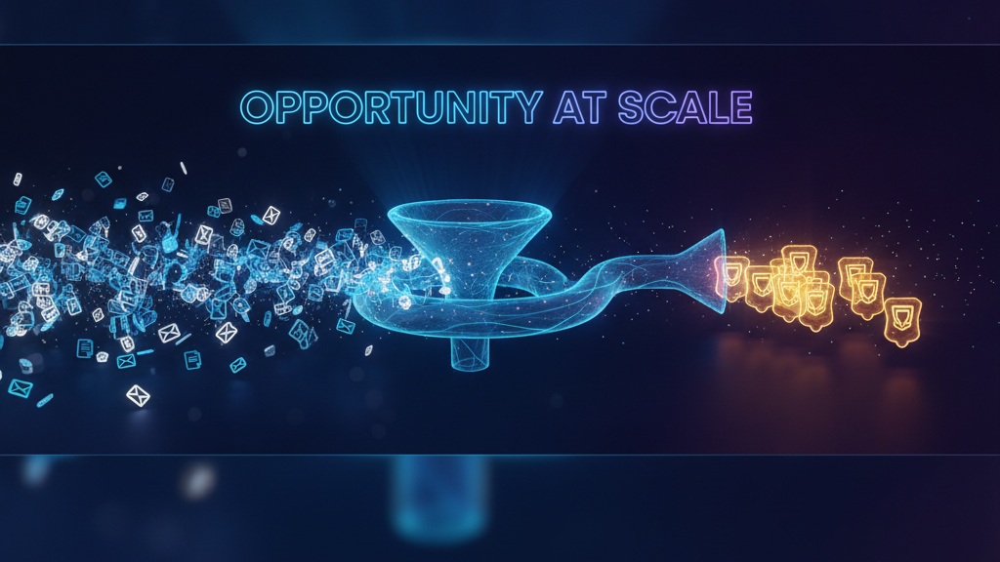
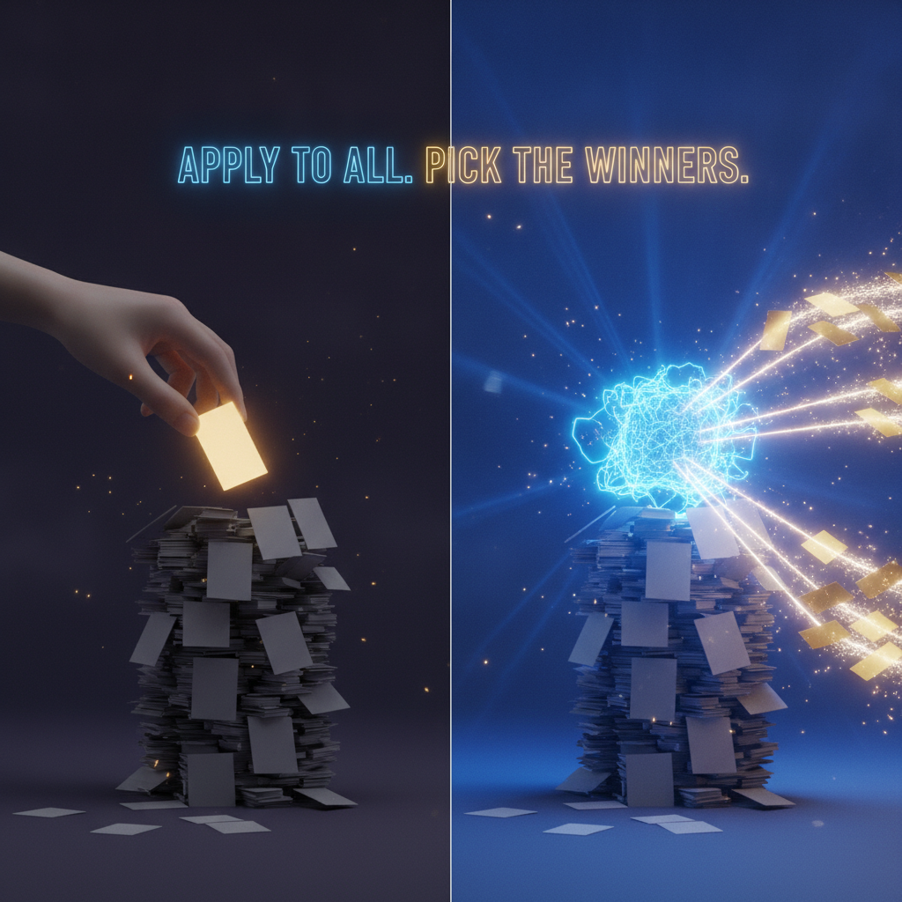
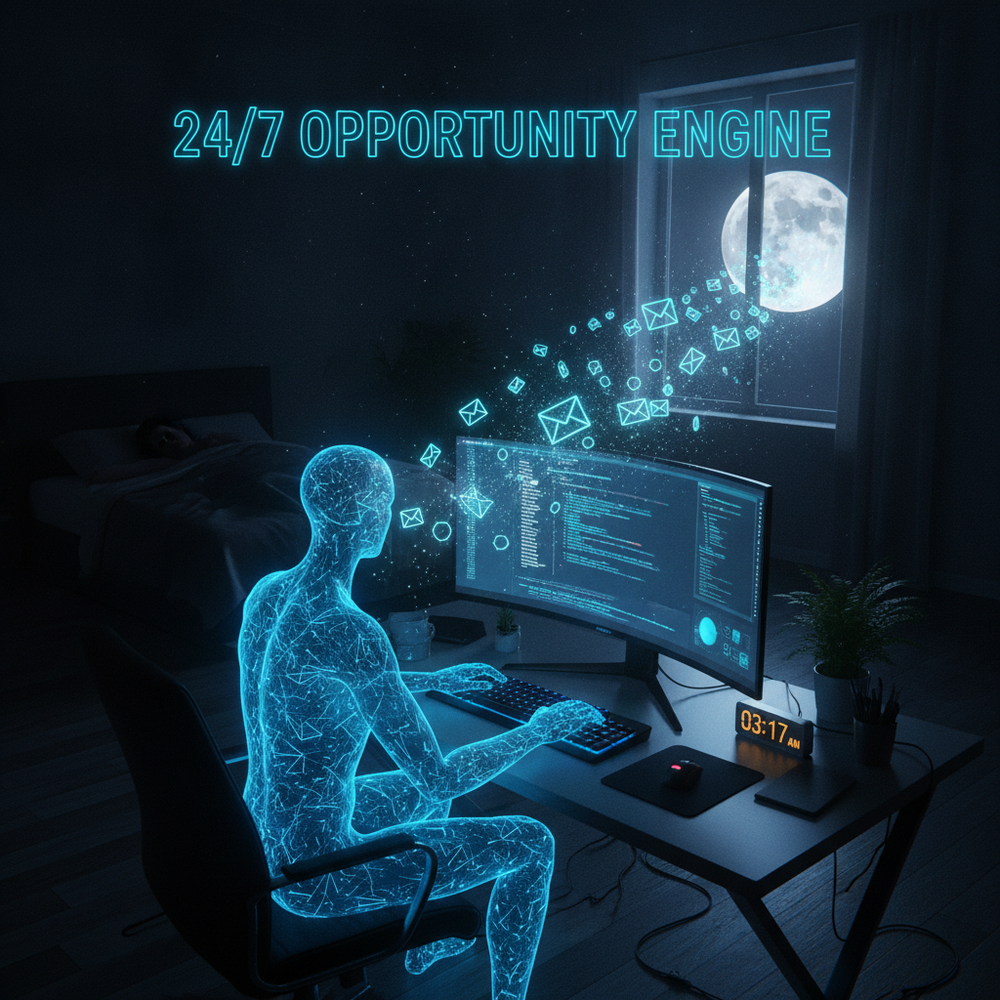
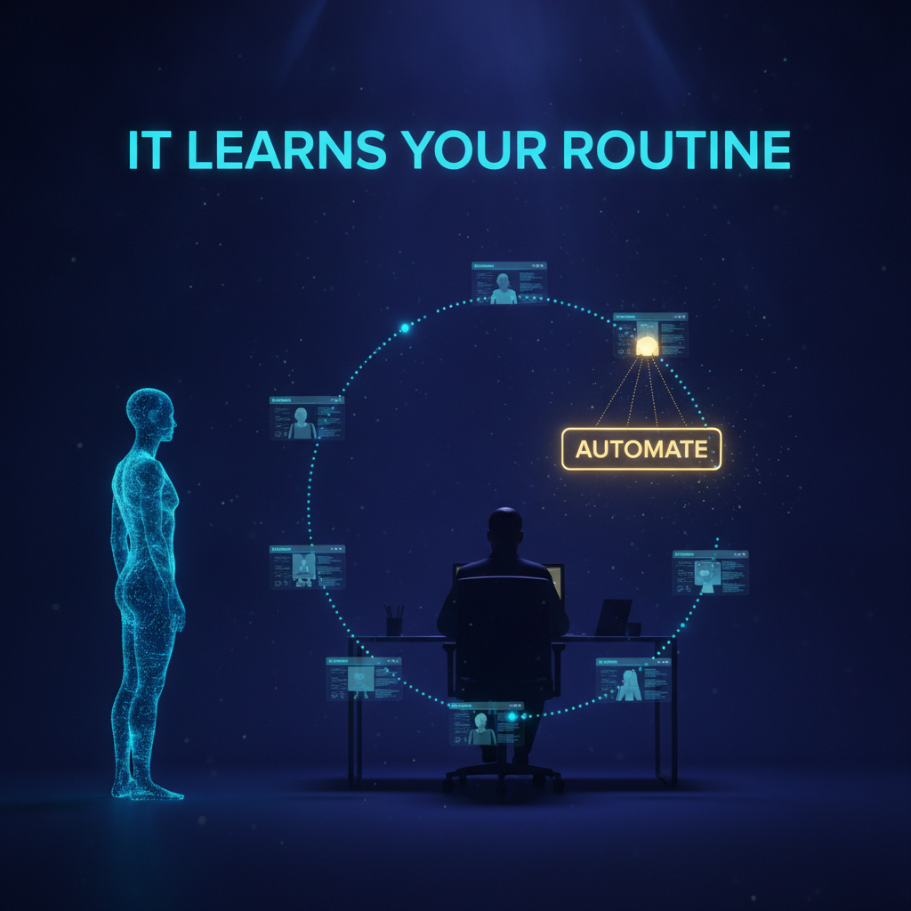
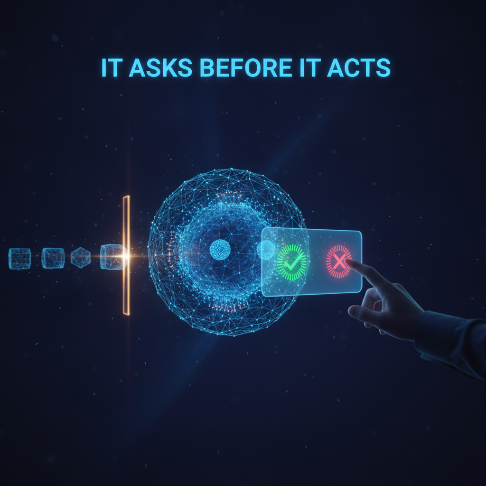
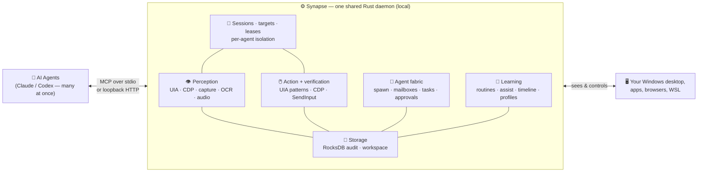
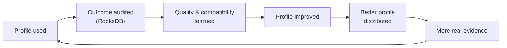

<p align="center">
  
</p>

<h1 align="center">Synapse</h1>

<p align="center">
  <strong>Turn opportunity into a numbers game.</strong><br>
  Give any AI model a real body on your Windows PC — so it can find, chase, and win
  opportunities around the clock while you keep your mouse.
</p>

<p align="center">
  
  
  
  
  
</p>

<p align="center">
  <a href="https://www.youtube.com/@Leapableai"></a>
  <a href="https://x.com/ChrisRoyseAI1"></a>
  <a href="https://www.linkedin.com/in/christopher-royse-b624b596/"></a>
</p>

---

## Why Synapse

<p align="center">
  
</p>

**Every business's growth is capped by one thing: the opportunities in front of it.**
Grants. Clients. Contracts. Investors. Partnerships. Job leads. It doesn't matter
what you do — if you want to grow, you need *more* and *better* opportunities. Everyone
knows this. Almost nobody does the work, because the work is soul-crushing volume:
hundreds of applications, thousands of outreach messages, endless forms.

Synapse changes the math. It gives any AI model — Claude, Codex, whatever you run —
a real body on your Windows PC: eyes to see the screen, hands to click and type, and
the stamina to run **24/7**. So instead of a person hand-picking the five opportunities
they have time for, an agent goes after *all* of them and brings back what actually
qualified. **Opportunity stops being a qualitative bottleneck and becomes a quantitative
pipeline.**

### Flip the script



The old way: you have 1,000 possible opportunities, so you rank them, rationalize your
way down to the "best" five, and let the other 995 die on the vine.

The Synapse way: you go after **all 1,000**. Then you sit back and choose from whatever
comes back — the meetings booked, the grants approved, the replies that landed. You were
only ever going to pursue the highest-payout few by hand. Now you can *also* pursue the
thousand smaller ones you'd have skipped — and staff, sell, or ignore the wins on your
own terms.

It's a complete inversion of how opportunity works: **apply to everything, then pick the
winners** — instead of picking first and applying to almost nothing.

<br clear="all">

### What one always-on agent has actually done

These are **real overnight runs** on a single Synapse-connected agent — the kind of work
no human would sit and do by hand, and no one would hire out:

- 🌱 **Found 270 startups** with over **$2M in seed funding** overnight — then went back
  and **auto-filled applications** to pitch each one.
- 📝 **Filed 40 grant applications** — the tedious, high-value paperwork that normally
  never gets done.
- 📬 **Messaged 300+ VCs and angel investors** — turning into real replies, meetings,
  and a live deal pipeline.

None of it required babysitting. You write one prompt; the agent works the list.

### The economics



For roughly the cost of a **~$200/month** model subscription, you get an agent that runs
**24 hours a day, 7 days a week**, doing nothing but generating opportunities. It never
gets bored, never gets discouraged by rejection, and never skips the boring forms.

The most valuable thing here isn't removing work humans already do. It's unlocking
**entirely new workflows** — the ones a human would *never* do manually (apply to a
thousand grants, message every relevant investor, watch a channel around the clock) but
that you'd absolutely want done if something tireless could do them. Wake up to a full
inbox of opportunities and decide which ones are worth your time.

<br clear="all">

### It's the foot in the door


If you sell services — agency, consulting, automation, AI — the hardest barrier is
**trust**: trust in you, and trust in AI. The way past it is to hand someone *one thing*
that delivers obvious, immediate value. Once a business starts making money from that
first thing, they trust you on everything else.

Synapse is that first thing. Every business has the opportunity problem, and everyone
recognizes it the moment you name it. You don't even need to know their industry — walk
into an insurance office, a construction firm, a law practice, and the pitch is the same:
*"You have opportunities you're leaving on the table because chasing them isn't worth a
person's time. What if something chased all of them for you?"* Install is light (a Rust
runtime + Synapse, then you just prompt it), and you're in the door.

> 🎓 Want to learn how to pitch and deploy Synapse for real businesses? Follow along on
> **[YouTube @Leapableai](https://www.youtube.com/@Leapableai)** and join the community.

<br clear="all">

---

## The idea in one line

> **Your AI model is the brain. Synapse is the body.**

Large language models can reason brilliantly — but on their own they can't *see* your
screen, *move* your mouse, *press* a key, or *stay at it* for hours. Synapse is the
missing body: a fast, local **Rust** server that speaks the
[Model Context Protocol](https://modelcontextprotocol.io) and plugs straight into
**Claude Code, Codex, and the Claude Desktop app**, giving the connected model a real,
low-latency interface to your Windows machine. And not just *one* model — a whole
**team of agents** can share the same PC through one Synapse daemon, each in its own
isolated session, while you keep working.

<p align="center">
  
</p>

Everything runs **on your machine**. No screen-scraping cloud service, no remote agent,
no data leaving your PC. Synapse is Windows-native to the metal: Win32 `SendInput`, UI
Automation, Windows Graphics Capture / DXGI, WASAPI audio, and local process control.

---

## What you can do with it

Synapse exposes **40 focused MCP tools** — a small, clean facade surface where every tool
takes an explicit `operation`, and every mutating action names the source of truth it
reads back from. (One tool, the raw browser debugger, is break-glass–gated behind an
explicit profile switch.) Here's what those 40 tools unlock.

### 👁️ It can see — structured perception


Synapse hands the model the screen as **clean, low-token structured data**, not a giant
screenshot it has to squint at:

- **`observe`** — the focused window, the full UI Automation element tree (every button,
  field, and menu with its on-screen box), detected entities, and HUD.
- **`find`** — locate any element or on-screen entity by name, role, or free text.
- **`read_text`** — OCR any region or element. Reads pixels directly, so it works even
  where the accessibility API can't reach (canvases and custom UIs).
- **`screenshot`** — per-window Windows Graphics Capture (and GIF capture), so an agent
  can photograph *its own* window even when it's behind yours.
- **`subscribe`** — stream live events (focus changes, new windows, audio) instead of
  polling.
- **Browser DOM mode** — Synapse-launched Chromium browsers expose real page nodes
  through CDP; `observe` and `find` merge them in.

All of it is **window-targetable**: point a session at a specific window with
`target` (`operation=set`) and perception watches *that* window — focused or not.

<br clear="all">

### 🖱️ It can act — precise, human-like control


Real input, synthesized through Win32 — not brittle macros. Everything routes through the
one **`act`** facade (`operation=invoke`), which picks the right delivery path per verb:

- **click, stroke, scroll** — mouse control with timing profiles for point/element moves,
  optional-button drags, and explicit shaped paths.
- **type, press, keymap, combo** — type Unicode text with *human-like* keystroke dynamics,
  press chords, or fire profile-defined key aliases.
- **set_value** — set a field's value directly through UI Automation and read it back from
  the source of truth — no keystrokes needed.
- **clipboard, launch, focus** — clipboard round-trips, launching apps (including *hidden*
  launches that never flash a window), and explicit, lease-gated window focus via
  `act operation=foreground`.

Actions don't just *fire* — they **verify**. Every click, keystroke, and value write is
read back from a separate source of truth (UIA state, CDP DOM, even OCR of the pixels) so
the agent knows the action *actually landed*, not just that the input was sent.

<br clear="all">

### 🎯 It moves like a human — wind-mouse motion


Robotic, perfectly-straight cursor teleports are a tell — and some UIs (canvases,
drag-and-drop) outright break on them. The `act` stroke path generates **physically
plausible motion**: a **wind-mouse model** with gravity and turbulence so every path bends
and wavers like a real hand, **velocity profiles** that accelerate out and decelerate in
along the *curve*, and **explicit shaped paths** to draw a star, trace a signature, or drag
a slider along an exact polyline. Every stroke is audited with its motion model and path ID.

<br clear="all">

### 🌐 It can browse — silent background web control


The web isn't pixels to Synapse — it's **structured DOM data**, and it can work it
*without ever touching your mouse or stealing a tab*:

- **`browser_tabs`** — open, select, and close **background tabs** that never become the
  active tab. The page you're reading stays exactly where it is.
- **`browser_nav`** — navigate, reload, back, and forward, all in the background.
- **`browser_dom`** — read page content, locate and inspect nodes, and pull ARIA
  snapshots straight from the DevTools accessibility tree.
- **`browser_form`** — set values and fill forms through CDP (`insertText`, dispatched
  events) instead of the cursor, so web forms fill while the browser sits behind your work.
- **`browser_wait` · `browser_capture` · `browser_storage`** — wait on conditions,
  screenshot pages and read downloads, and read/write cookies and storage.
- **Graceful fallback ladder** — raw CDP → bundled extension bridge → OCR over the rendered
  page → honest `uia_only`, with diagnostics that tell the agent *which* path it got.

This is the engine behind "message 300 investors" and "fill out 270 applications" — silent,
background, tab-by-tab.

<br clear="all">

### 🔭 It tracks change — delta-first reality


Re-sending the whole screen on every step is slow and expensive. The **`reality`** facade
takes a **baseline**, then streams the agent **only what changed** — and audits its own
assumptions against physical reality:

- **`reality operation=baseline`** — a compact, redacted snapshot (~hundreds of tokens).
- **`reality operation=delta`** — ordered, field-level changes since a cursor. Change a
  clipboard, a window, a value — you get back *just that delta*.
- **`reality operation=audit`** — re-reads the real machine and reports drift, forcing a
  rebase when the agent's mental model has gone stale.

The payoff: token cost stays flat across a 12-screen wizard or an hours-long run.

<br clear="all">

### 🧭 It learns your routine — mining + proactive assist



Synapse doesn't just do what it's told — it watches how *you* work and finds the loops
worth automating:

- **`routine`** — mine repetitive workflows from the activity timeline (`operation=mine`),
  inspect and label them, take your feedback, and **turn a recognized routine into an armed
  automation** (`operation=automate`).
- **`assist`** — read the current intent, detect what you're trying to do, and surface
  **suggestions** you can accept or dismiss (`operation=suggestion_list` /
  `suggestion_accept`).
- **`timeline` · `episode`** — a searchable activity timeline and episodic memory of what
  happened, so both you and the agent can look back at what worked.

The result: the boring sequence you do fifteen times a day becomes one "automate this" button.

<br clear="all">

### 🤝 It keeps you in the loop — approvals, gates & verification



A tireless agent that acts without asking is a liability. Synapse builds **human-in-the-loop
control** into the surface itself:

- **`approval`** — the agent can **request approval**, **gate** a sensitive action behind a
  decision, or **ask the operator** directly — and wait for a yes/no before proceeding.
- **`escalation`** — configurable escalation rules and an acknowledgement queue, so the
  agent knows *when* to stop and get a human.
- **`verification`** — actions are verified against independent sources of truth; the
  verification inbox and audit let you prove *what actually happened*, not just what was
  attempted.

So the overnight agent runs hard on the safe stuff and **pauses to ask** on anything that
needs your judgment.

<br clear="all">

### 🤖 It shares your PC — foreground-safe, multi-agent


Most computer-use stacks assume **one agent owns the whole desktop** — it hijacks your
mouse, steals focus, and you just watch. Synapse is built on the opposite premise: **many
agents and a human share one PC at the same time.**

- **Per-session targets** — `target operation=set` points each agent at *its own window*
  (or browser tab); `observe`, `find`, `read_text`, and `screenshot` all honor it.
- **Capability-preserving actions** — clicks, text, and values route through UI Automation
  patterns, CDP, direct window messages, and each session's logical foreground lane before
  ever considering the shared cursor. Most work never needs the human's real foreground.
- **Target claims** — `target operation=claim` gives a session exclusive ownership of a
  window; another agent that tries to mutate it **fails closed**. No two agents typing into
  the same field.
- **Explicit foreground** — the few genuinely-foreground actions (real cursor moves, global
  keystrokes, window focus) require an explicit reason via `act operation=foreground`. The
  human always wins: Synapse refuses implicit focus stealing.
- **Per-session clipboards** — each agent gets a virtual clipboard buffer; your real Win32
  clipboard is untouched.

The full per-tool background/lease audit is checked in as the
[Multi-Agent Capability Matrix](docs/multi-agent-capability-matrix.md).

<br clear="all">

### 🧬 It multiplies — spawn and orchestrate agent teams


One agent is useful. A **coordinated team** is a different category of thing — and Synapse
ships the primitives to run one on a single machine, through the **`agent`**, **`task`**,
and **`workspace`** facades:

- **`agent operation=spawn`** — an agent spawns *more agents* in hidden terminal sessions:
  launcher resolved, token injected, MCP wired, optionally bound to their own target window
  — plus steer, pause, resume, interrupt, and durable **mailboxes** (`send`, `inbox`,
  `wait`, `broadcast`) that survive restarts.
- **`task`** — a shared **task queue**: create, claim, dispatch, and reconcile units of work
  so a fleet can pull from one backlog instead of colliding.
- **`workspace`** — a run-scoped **shared blackboard** with artifact handles (size- and
  hash-verified files) and live notifications when a teammate publishes.

Orchestrator delegates, workers pull from the queue, everyone reads the same blackboard —
all locally, all audited.

<br clear="all">

### 🌙 It works the night shift — durable shell jobs


The **`shell`** facade runs quick commands inline (`operation=run`) — but real work
(builds, training runs, data crunches, hours-long outreach loops) outlives any single
request:

- **`shell operation=start`** — launch a hidden, durable child process with **no lifetime
  cap by default**. It runs until *it* finishes, not until a timeout guesses wrong.
- **`shell operation=status`** — check in any time: persisted `status.json`, stdout/stderr
  log tails, and a live process-table read.
- **`shell operation=cancel`** — terminate only the job's recorded process tree; it never
  sweeps unrelated terminals, browsers, IDEs, or daemons.
- Jobs get complete Windows child environments, per-session isolation, and WSL reach
  (`wsl.exe`) — so "kick off the 6-hour job, check hourly, summarize at dawn" is a real,
  safe workflow. (`process` handles launches, history, and the live process list.)

<br clear="all">

### 🧠 It compounds — the profile + audit flywheel


Synapse ships **29 application profiles** that encode how to operate Notepad, Chrome, Excel,
Word, Outlook, Teams, Slack, Explorer, Terminal, and more — and it gets *better with use*:

- Every action is logged to a local **RocksDB** audit trail.
- **`profile`** activates and manages the right profile per app; **`audit`
  operation=profile_intelligence** turns real outcomes into quality signal per profile.
- **`audit`** also exposes command history, lifecycle events, and a consented export bundle;
  **`replay`** records sessions for demos and inspection.

The compounding loop: *profile used → outcome audited → quality learned → profile improved →
better profile distributed → more evidence.*

<br clear="all">

### 🔒 It stays yours — 100% local & private


- Runs entirely on your machine over **stdio** or **loopback HTTP** (bearer-auth,
  loopback-only by default).
- The **`privacy`** facade pauses/resumes capture, manages exclusions, and redacts or purges
  history on demand; **`hygiene`** scans stored text for anything sensitive.
- Sensitive fields are **hash-redacted** before they're ever persisted — raw clipboard text,
  window titles, chat bodies, and secrets never hit storage.
- Audit export is **off unless you consent**, with a redaction report.

<br clear="all">

---

## How it works



The model stays the planner. Synapse owns the fast, native, stateful parts — perception
assembly, verified input, an agent fabric, and a durable audit trail — so the agent gets
crisp senses, reliable hands, and a memory of what worked. One shared daemon serves **every
connected agent at once**, each in its own session with its own target, clipboard, and (when
needed) explicit foreground.

### The learning flywheel



---

## Install

Open Claude Code, Codex, or any coding agent **on the Windows machine you want Synapse to
control**, and paste this:

```text
Install Synapse for me and wire it into my AI tools.

1. Clone the repo: git clone https://github.com/ChrisRoyse/Synapse.git
   (cd into it; if it already exists, git pull instead).
2. Build and install the MCP server globally with cargo:
     cargo install --path crates/synapse-mcp --force
   This drops synapse-mcp.exe into my Cargo bin dir
   (%USERPROFILE%\.cargo\bin\synapse-mcp.exe). Find the absolute path to that
   binary and use it verbatim for the daemon and stdio-only Claude Desktop
   config below.
3. Start the Windows HTTP daemon once and read its bearer token from
   %APPDATA%\synapse\token.txt. Set SYNAPSE_BEARER_TOKEN in the Windows user
   environment to that exact token, and install the Synapse token loader into
   the standard Codex launchers so future Codex processes load the token before
   MCP starts.
4. Connect it to Claude Code (user scope) with Streamable HTTP:
     claude mcp add --scope user --transport http synapse http://127.0.0.1:7700/mcp --header "Authorization: Bearer <token>"
5. Connect it to Codex by adding this to ~/.codex/config.toml:
     [mcp_servers.synapse]
     url = "http://127.0.0.1:7700/mcp"
     bearer_token_env_var = "SYNAPSE_BEARER_TOKEN"
     required = true
     default_tools_approval_mode = "approve"
6. Connect it to the Claude Desktop app by adding a "synapse" server to
   %APPDATA%\Claude\claude_desktop_config.json under "mcpServers" with the same
   command and ["--mode","connect","--bind","127.0.0.1:7700"] args. Preserve any existing servers in that file.
7. Verify: restart each client, then call the Synapse `health` tool through the
   real MCP client and confirm it returns { "ok": true, ... }. If an
   already-running Codex session still says `Transport closed`, restart Codex
   through the patched launcher; Windows cannot update that process environment
   after it has started.

I'm on Windows. Use the real absolute Cargo bin path, don't invent one, and tell
me anything that needs my approval (e.g. installing the Rust toolchain).
```

You'll need a stable **Rust toolchain** (`rustup` / `cargo`). If `cargo` is missing, grab
it from <https://rustup.rs> first, or let the agent install it.

### Setup scripts (Windows **or** WSL — Windows always controls both)

Synapse has exactly **one controlling body**: the Windows-native `synapse-mcp.exe` HTTP
daemon. It is the only process that can perform real Win32 `SendInput`, UI Automation, and
WGC/DXGI capture — and it controls **both** Windows programs (native windows) **and** WSL
programs (WSLg GUI apps render as real Windows windows; `shell` / `process` reach WSL CLIs
via `wsl.exe`). Every MCP client — on Windows or in WSL — connects to that one daemon, so
*wherever you install from, the result is identical*: one Windows daemon driving both worlds.

**From WSL** (builds the Windows daemon through interop, then wires Claude Code and Codex on
the WSL side):

```bash
./scripts/synapse-install.sh
```

**From native Windows** (PowerShell):

```powershell
./scripts/synapse-setup.ps1 -SourceDir (Resolve-Path .)
```

Both are idempotent and fail loud — each prerequisite is checked and a failure stops with
the exact cause and fix (no silent fallbacks). They build the daemon from a **local** source
path into a persistent target (re-installs are incremental, not a fresh RocksDB build),
deploy the bundled profiles next to the binary, generate a loopback bearer token, register
the auto-start daemon (interactive desktop session, single-writer DB) with `--profile-dir`,
verify `health`, and wire detected MCP clients. Claude Code and Codex use Streamable HTTP;
Windows Codex launchers also get a Synapse token loader so new Codex processes do not depend
on a stale parent environment. Claude Desktop on Windows uses the `connect` bridge because it
is stdio-only. WSL clients must not launch the Windows `.exe` bridge directly.
Re-run any time to update; `-Remove` (PowerShell) uninstalls the daemon task.

### Build it yourself

```bash
cargo build --release --workspace
cargo install --path crates/synapse-mcp --force   # -> %USERPROFILE%\.cargo\bin\synapse-mcp.exe
```

### Build the dashboard bundle

```bash
cd dashboard
bun install --frozen-lockfile
bun run build
```

The dashboard build is local-only. It writes hashed static assets to `dashboard/dist/`; the
daemon embeds those files and serves them from loopback under `/dashboard`. Run
`bun run check` as a supporting charter check before manual Synapse verification.

### Wire it up manually

<details>
<summary><strong>Claude Code, Codex, and Claude Desktop config</strong></summary>

Claude Code (user scope):

```bash
claude mcp add --scope user --transport http synapse http://127.0.0.1:7700/mcp --header "Authorization: Bearer <token>"
```

Codex (`~/.codex/config.toml`):

```toml
[mcp_servers.synapse]
url = "http://127.0.0.1:7700/mcp"
bearer_token_env_var = "SYNAPSE_BEARER_TOKEN"
required = true
default_tools_approval_mode = "approve"
```

Claude Desktop (`%APPDATA%\Claude\claude_desktop_config.json`):

```jsonc
{
  "mcpServers": {
    "synapse": {
      "command": "C:\\Users\\you\\.cargo\\bin\\synapse-mcp.exe",
      "args": ["--mode", "connect", "--bind", "127.0.0.1:7700"]
    }
  }
}
```

</details>

After the client loads the server, ask it to call the `health` tool — you should get back
`{ "ok": true, "version": "0.1.0", ... }` with each subsystem's status.

---

## See it in action

Once it's connected, just ask your agent in plain English. For example:

> *"Find every startup that raised over $2M in seed funding this year, then open background
> browser tabs and draft an application to each — don't touch my mouse or my active tab."*

> *"Open Notepad, type a short intro to Synapse, then select-all, copy, and read the
> clipboard back to prove the text landed."*

> *"Take a reality baseline, then tell me only what changed after I open a new window."*

> *"Watch how I file these invoices, mine the routine, and offer to automate it next time."*

> *"Open three background browser tabs, pull the pricing tables from each, and drop a
> comparison in a file — and ask me before you submit anything."*

> *"Kick off the full release build as a durable job and check on it every few minutes while
> we keep working on other things."*

Behind the scenes the agent calls `process` (launch), `act`, `browser_tabs`, `browser_dom`,
`observe`, `read_text`, `reality`, `routine`, `approval`, and friends — and every action is
captured to the local audit trail.

---

## Push it to the extreme

<p align="center">
  
</p>

Everything above composes. One brain, one body is the baseline — here's what the *ceiling*
looks like. These are real prompts you can give a Synapse-connected agent today:

**🐝 An opportunity swarm on one PC — while you keep working**

> *"Spawn three hidden agents. Agent one hunts new grants and posts qualifying ones to the
> shared workspace under `run:opportunities`. Agent two watches that workspace and drafts an
> application for each in its own Word window. Agent three messages matching investors in
> background browser tabs. Claim each window so they can't collide, don't take my
> foreground — I'm using the mouse — and pause to ask me before anything is actually
> submitted."*

Four agents (counting the orchestrator) on one desktop: spawned via `agent operation=spawn`,
pulling from a shared `task` queue and coordinating through `workspace`, each owning its
window via `target operation=claim`, gated by `approval` — and your cursor never moves.

**🌙 The overnight shift**

> *"It's 11pm. Start the full build-and-test pipeline as a durable shell job. Check status
> every 15 minutes; if a dialog pops up, OCR it and decide. When tests pass, draft the
> release notes from the git log in Notepad and leave a summary in the workspace. If anything
> fails, capture a screenshot of the error and stop. I'll read it all at 7am."*

Durable jobs (`shell operation=start/status`), screenshot + OCR perception, and the audit
trail give you a *provable* record of what happened while you slept.

**🎧 Perceive three channels at once**

> *"Join the meeting, transcribe the system audio live, and while it runs, fill in the CRM
> form in the background window from yesterday's notes. When someone says my name in the
> transcript, ping me."*

WASAPI audio capture + Whisper transcription, background form-fill through `browser_form` /
`act` value patterns, and event subscriptions — three sensory channels, one agent.

**🖥️ A self-driving install**

> *"Here's the vendor's setup wizard. Click through it: take a reality baseline first, advance
> step by step verifying each screen by delta, OCR any EULA into a file, pick the custom-path
> option, and audit drift at the end so we know nothing unexpected changed."*

Delta-first `reality` keeps token cost flat across a 12-screen wizard, and every click is
verified against UIA readback before the next one fires.

**🧭 Teach it your workflow**

> *"For the next hour, watch how I triage support tickets. Then mine the routine, show me the
> pattern you found, and — if I approve it — arm it so the repetitive part runs itself next
> time."*

The `routine` mining + `assist` + `approval` pipeline turns one observed session into a
reusable, human-approved automation.

---

## The full tool surface

The default production surface is **facade-first**: 40 tools, each with a strict `operation`
enum. Call `tools/list` on the running `synapse-mcp` server for the live registry. At a
glance:

| Facade | Key operations |
|---|---|
| `health` | daemon + subsystem status |
| `profile` | `status` · `set` |
| `session` | `list` |
| `subscribe` | `events` |
| `observe` | `current` |
| `find` | `elements` |
| `read_text` | `text` |
| `screenshot` | `capture` · `gif` |
| `target` | `get` · `list` · `set` · `clear` · `claim` · `status` · `adopt` · `release` |
| `act` | `invoke` · `foreground` |
| `shell` | `run` · `start` · `status` · `cancel` |
| `process` | `list` · `launch` · `history` |
| `browser_tabs` | `list` · `select` · `new` · `close` |
| `browser_nav` | `navigate` · `reload` · `back` · `forward` |
| `browser_dom` | `content` · `locate` · `inspect` · `aria_snapshot` |
| `browser_form` | `set_value` · `fill` |
| `browser_wait` | `for_condition` |
| `browser_capture` | `screenshot` · `downloads` |
| `browser_storage` | `read` · `write` |
| `browser_debugger` 🔒 | raw CDP: `evaluate` · `console_messages` · `network` · `route` · … (break-glass) |
| `workspace` | `get` · `put` · `list` · `subscribe` · `exists` · `delete` |
| `agent` | `spawn` · `send` · `inbox` · `wait` · `broadcast` · `steer` · `pause` · `resume` · `kill` · templates |
| `task` | `create` · `get` · `update` · `claim` · `cancel` · `list` · `next` · `reconcile` · `dispatch_once` |
| `approval` | `request` · `list` · `decide` · `gate` · `ask_operator` |
| `escalation` | `config_get` · `config_set` · `list` · `ack` |
| `timeline` | `get` · `search` · `stats` |
| `episode` | `list` · `get` |
| `routine` | `mine` · `list` · `inspect` · `update` · `feedback` · `label` · `automate` |
| `assist` | `intent` · `detect` · `suggestion_list` · `suggestion_accept` |
| `reality` | `baseline` · `delta` · `audit` |
| `verification` | `inbox` · `poll` · `audit` · `bind` · `sources` |
| `storage` | `inspect` · `summary` · `gc_once` |
| `model` | `list` · `status` · `probe` · `register` · `update` · `remove` |
| `cost` | `summarize` · `price_list` · `price_put` · `price_delete` |
| `hygiene` | `scan_text` · `scan_storage` · `flags` · `report` |
| `audit` | `command_query` · `lifecycle_events` · `profile_intelligence` · `export_bundle` |
| `replay` | `record` · `demo_start` · `demo_stop` · `artifact_inspect` |
| `privacy` | `pause` · `resume` · `exclusions` · `redact` · `purge` |
| `setup` | `status` · `doctor` · `repair` |
| `telemetry` | `status` |

Every mutating operation names the physical readback source of truth — a file path, RocksDB
CF/key, process id, tab id, target id, event cursor, or profile row — so "it worked" is
always backed by evidence. Full mapping and migration notes:
[Synapse 40-Tool Surface](docs/SYNAPSE_40_TOOL_SURFACE_MIGRATION.md).

---

## Under the hood

| Layer | Technology |
|---|---|
| Language / runtime | **Rust** (edition 2024), `tokio` |
| Protocol | **MCP** via `rmcp` — stdio + streamable HTTP/SSE, one shared daemon, per-session state |
| Perception | Windows UI Automation, Windows Graphics Capture / DXGI duplication, WinRT OCR |
| Browser | **Chrome DevTools Protocol** — DOM/AX-tree perception, background tabs, page input; bundled extension bridge for normal profiles |
| Action | Win32 `SendInput` (`enigo`), UIA control patterns, CDP input, verified readback |
| Multi-agent | Per-session targets & clipboards, target-claim ownership, task queue, RocksDB mailboxes + workspace blackboard, approvals & escalation |
| Learning | Routine mining, intent/assist, activity timeline & episodes, profile quality from audit |
| Audio | WASAPI loopback + Whisper-tiny STT |
| Storage | **RocksDB** (LZ4 + ZSTD), durable audit trail |
| Models | ONNX Runtime (`ort`) for optional detection |

The active documented input backend is **`software`**: keyboard and mouse via `SendInput`,
plus semantic UIA/CDP paths where the target supports them. Routine/assist scheduling,
storage GC, and disk-pressure handling all run as background tasks inside the server.

---

## About the author

Synapse is designed and built by **Chris Royse** — solo developer, founder of
**Leapable AI**.

<p align="center">
  <a href="https://www.youtube.com/@Leapableai"></a>
  <a href="https://x.com/ChrisRoyseAI1"></a>
  <a href="https://www.linkedin.com/in/christopher-royse-b624b596/"></a>
</p>

Follow along on **[YouTube @Leapableai](https://www.youtube.com/@Leapableai)** for demos,
deep dives, and how to pitch Synapse to real businesses — and on
**[X @ChrisRoyseAI1](https://x.com/ChrisRoyseAI1)** for updates.

---

## License

**Synapse is source-available, not open source.**

- ✅ **Free for noncommercial use** under the
  [PolyForm Noncommercial License 1.0.0](LICENSE.md).
- 💼 **Commercial or business use** — using Synapse inside a company, or building a product
  or service with it — requires a separate **paid commercial license**. See
  [COMMERCIAL-LICENSE.md](COMMERCIAL-LICENSE.md) or email **chrisroyseai@gmail.com**.

Copyright © 2026 Chris Royse. See [LICENSE.md](LICENSE.md) for full terms.

---

## 💛 Support Synapse

Synapse is built and maintained by one solo developer. If it's useful to you — or you'd like
to help fund new application profiles, features, and ongoing development — please consider
sending a donation or a message of support.

<p align="center">
  <a href="https://www.paypal.com/paypalme/ChrisRoyseAI"></a>
</p>

<p align="center">
  👉 <strong><a href="https://www.paypal.com/paypalme/ChrisRoyseAI">paypal.me/ChrisRoyseAI</a></strong> — donate or send a message to help support Synapse.
</p>

Every contribution directly funds buying applications to profile, token costs for testing,
and the time to keep shipping. Thank you! 🙏

---

<p align="center">
  <em>Your AI has a brain. Now give it a body — and turn opportunity into a numbers game.</em><br>
  <strong>⭐ Star the repo if Synapse is useful to you.</strong>
</p>

<p align="center">
  📫 <strong>Contact me:</strong> <a href="mailto:chrisroyseai@gmail.com">chrisroyseai@gmail.com</a>
</p>
